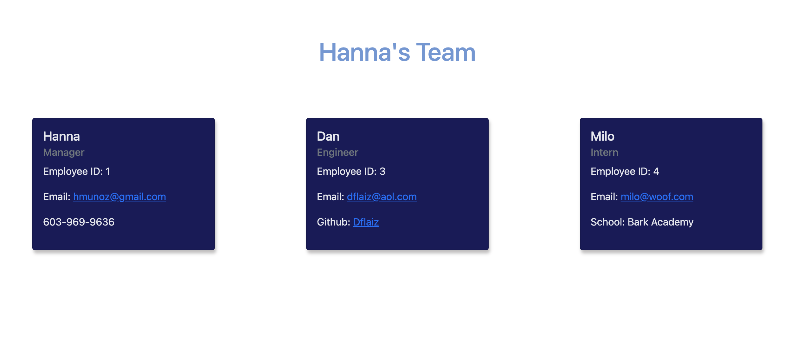

# Team Generator:
Using the command line, you are able to generate a team layout with information for managers, engineers and interns.

# How to Use:
Using the command line, use node to run the index.js file. This will bring up the prompt to enter the team's information. Once your team is complete an html file will be generated that can then be brought up in the browser.

# Processes Used:
- Jest
- Inquirer
- fs
- Bootstrap for styling

## Usage
[Click here for preview video](https://drive.google.com/file/d/1HDak5B1JGElsCjiBQnyCiVTMXsg42Qqf/view?usp=sharing)
